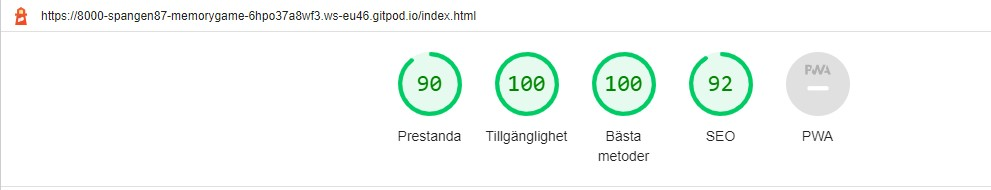

# Teddy Memory Game
This is a Memory Game that has been inspired from my daughters stuffed animals. It is a simple but yet challenging memory game with eight pairs of cards.

The game targets to be a fun and challenging way to learn concentrate and remembering things for children. But it also a nice way for adults to relax.

Welcome to [Teddy Memory Game](https://spangen87.github.io/memory-game/).

## User Experience (UX)
### Wireframes
The wireframes was made before the project started to guide the design. Some changes are made to the final version of the game.

 

### Site Structure
The Teddy Memory Game is a one page applictaion. All buttons and actions are avilable from the screen without the need to scroll. The start menu is a div that will be hidden when the game starts, and the game will be hidden when you enter the menu. The structure keeps the game in focus, and other elements are planned to minimalistic.

### Design Choices
#### Typography
For the logo of the game, I choosed Courgette. I Wanted a classy but yet playful look so I thought Courgette was a good font for that purpose. 

For the rest of the text I choosed Varela Round. It is easy to read, stylish and still a litlle bit playful.

#### Colors
I choosed colors with my daughers favourite color in mind, pink. [Colormind](http://colormind.io/) was used to pick a palette that I used through the application.

For the text on the buttons a had to use a darker color for readability. I used a darker color of brown (#5C483D).

## Features
### Existing Features

### Future Features
- A feature that could be added is that you can chose a nickname and that the score can be saved. That could add a competitive element to the game if you can compare scores with other users.
- Adding more levels of difficulty.
- Adding sound effects to the card flipping animation that can make it come more to life.

## Technologies Used
- [HTML](https://html.spec.whatwg.org/) - is setting the structure and the content of the website.
- [CSS](https://www.w3.org/Style/CSS/Overview.en.html) - providing the style for the pages.
- [JavaScript](https://developer.mozilla.org/en-US/docs/Web/JavaScript) - is making the site interactive. The engine for the game.
- [Gitpod](https://www.gitpod.io/#get-started) - used to develop and deploy the site.
- [GitHub](https://github.com/)  - is used to host the site.
- [Balsamiq](https://balsamiq.com/wireframes/) - was used to make the wireframes.

## Testing
### Browser Testing
- Google Chrome was used during development and there is no know issues in that browser. Although Chrome on iPhone are a little slow on the first animations.
- Mozilla Firefox is tested through the development process and there is no known issues.
- Microsoft Edge is tested in different resolutions with no known issues.
- Safari is only tested on mobile devices and there is no known issues in that browser.

### Responsiveness Test
Tests for mobile devices was made at [Googles Mobile Friendly Test](https://search.google.com/test/mobile-friendly).

Manual testing has also been done through the development. That has been done on mobile devices and in [Google Chrome DevTools](https://developers.google.com/web/tools).
Screens from 2560px down to 375px has been tested.

### Accessibility Testing
Accessibility was tested using [Lighthouse](https://developers.google.com/web/tools/lighthouse).
- Performance shows how the page perform in terms of loading speed.
- Acessibility shows how accessible the page are for all users.
- Best Practices shows that the site uses industry standard practices.
- SEO shows Search Engine Optimisation.

Results for [Teddy Memory Game](https://spangen87.github.io/memory-game/) page:

Mobile:

Computer:

At first, Lighthouse warned that there was not enough contrast between text and background. So i changed a color so that it passed.

### Validator Testing
The site is tested with [W3C HTML Validator](https://validator.w3.org/) for the HTML and for the CSS with [W3C CSS Validator](https://jigsaw.w3.org/css-validator/).
For the JavaScript [JSHint](https://jshint.com/) was used.

Here is the results for CSS and HTML:

The validation through JSHint showed no errors. There was some warnings for older browsers.
At first it showed some warnings for missing semicolons and a variable that i forgot that was unused. But that is now solved. 

## Bugs
Card animation will only work first time it is clicked. The bug was fixed by adding a remove class of the flipped cards in the function that check for pairs.

If you clicked more than two cards before they flipped back, it resulted in a error. The bug was fixed by adding a lock to the board while the timeout was running.

You can click on a card that is already facing up wich will get the count for matches to count wrong. It will also turn an already matched card to the wrong side.

The alert shown when finishing the game is not showing the time used correctly. Instead of the time it shows "[object HTMLSpanElement]".
## Deployment
### To deploy the project
This site is deployed using GitHub pages. This is the steps for deploying a site.
1. When in the repository navigate to the Settings tab.
2. Then navigate to the Pages link on the left side.
3. Navigate to Source and select master/main branch and then click Save.
4. When page is refreshed and the site is published successfully, a green box will show that it's finished.

Here is the link to the repository: [https://github.com/spangen87/memory-game](https://github.com/spangen87/memory-game)

### Forking the repository on GitHub
A copy of the repository can be made. This copy can be viewed and changed on an other account without affecting the original repository.

The steps for doing this:
1. Make sure you are logged in on GitHub and then find the repository.
2. On the top right there is a button called Fork.
3. Press the Fork button to make a copy to your account.

### How to clone the project
This is how you make a clone of the repository:

1. Click on the code tab under the repository name.
2. Then click on "Code" button to the right above the files listed.
3. Click on the clipboard icon to copy the URL.

4. Open Git Bash in the IDE of your choice.
5. Change the working directory to where you want your cloned directory.
6. Type `git clone` and then paste the URL that you copied.
7. Press enter and clone has been finished.

## Credits
### Content
- The font is picked from [Google Fonts](https://fonts.google.com/).
- Sulotion for randomizing the cards and setting up the array of cards [Fakorede Damilola](https://dev.to/fakorededamilola/create-a-memory-game-with-js-1l9j).

### Media
- All photos are taken by me, the [author](https://github.com/spangen87).
- Photos were compressed using [TinyPNG](https://tinypng.com/).
- Photos are edited in [Adobe Photoshop](https://www.adobe.com/se/products/photoshop.html).

## Acknowledgements
This game was made as Portfolio Project 2 for the Full Stack Software Developer education at [Code Institute](https://codeinstitute.net/).
I want to thank my mentor [Precious Ijege](https://www.linkedin.com/in/precious-ijege-908a00168/) for the support and for pushing me to do better and aim higher.
A credit to my four year old Daughter Bianca who choosed wich teddy bears that should be in the cards, and for helping me with the photagraphy.
I would also like to thank my colleagus Daniel and Järker at [Best Las](https://bestlas.se/) for giving me the opportunity and time neccessary to be able to do this education.
And lastly I would like to give a big thanks to [Ludde Hedlund](https://github.com/eddul-h) for helping me find bugs and for helping me figure out the solutions to them.

I hope this game can bring some joy to the children and adults who will take the time to play it.

Rikard Spångmyr, 2022